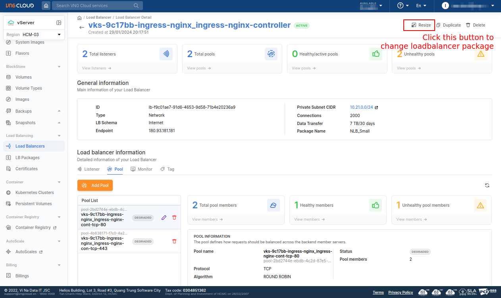
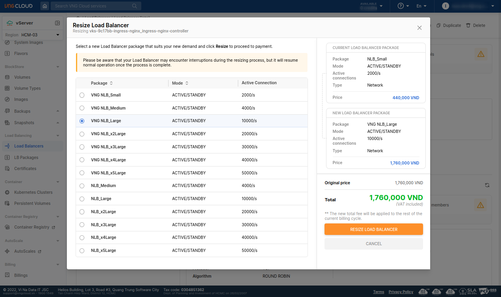
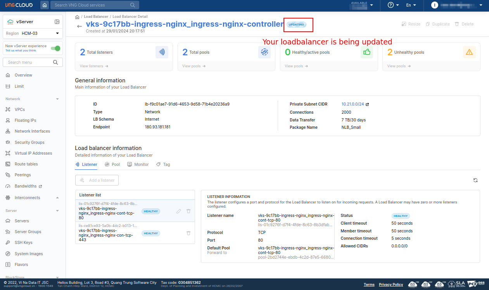

 

# Change LoadBalancer package
To change the package of the loadbalancers has been created, you CAN go to the [VNG-Cloud LoadBalancer dashboard](https://hcm-3.console.vngcloud.vn/vserver/load-balancer/vlb) to change the package of the loadbalancer.

Go the detail page of the loadbalancer you want to change the package, click on the **Resize** button.

  

Choose the package you want to change to and click on the **RESIZE LOAD BALANCER** button.

  
  

