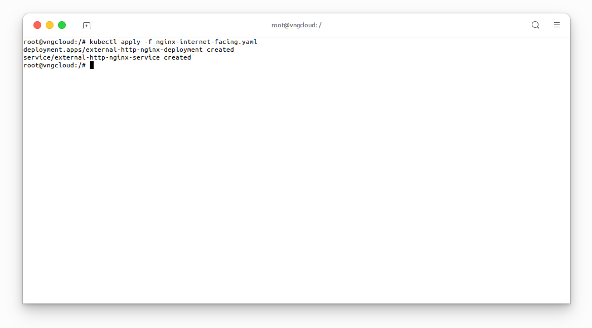
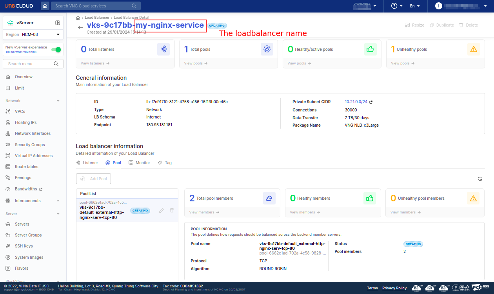
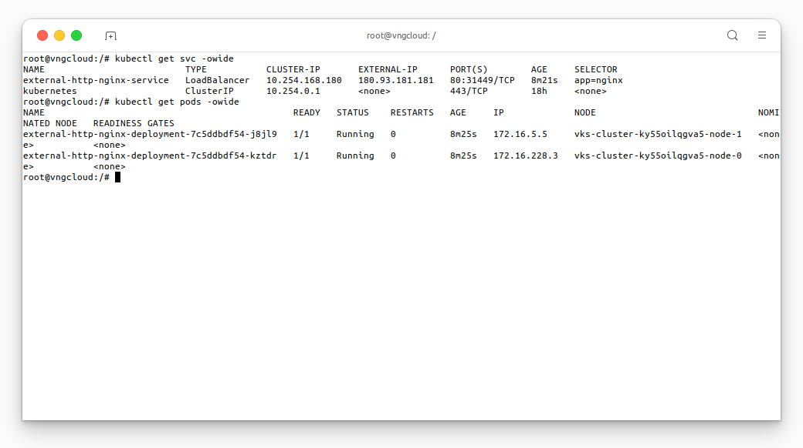
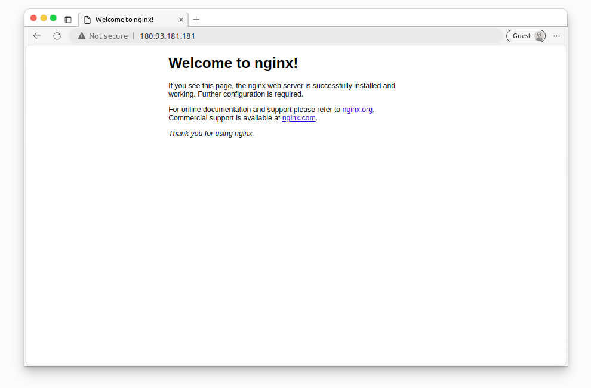
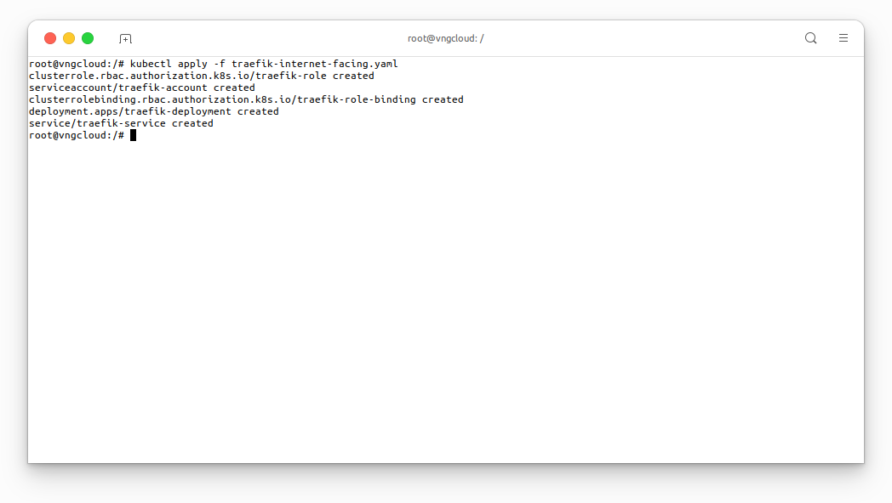
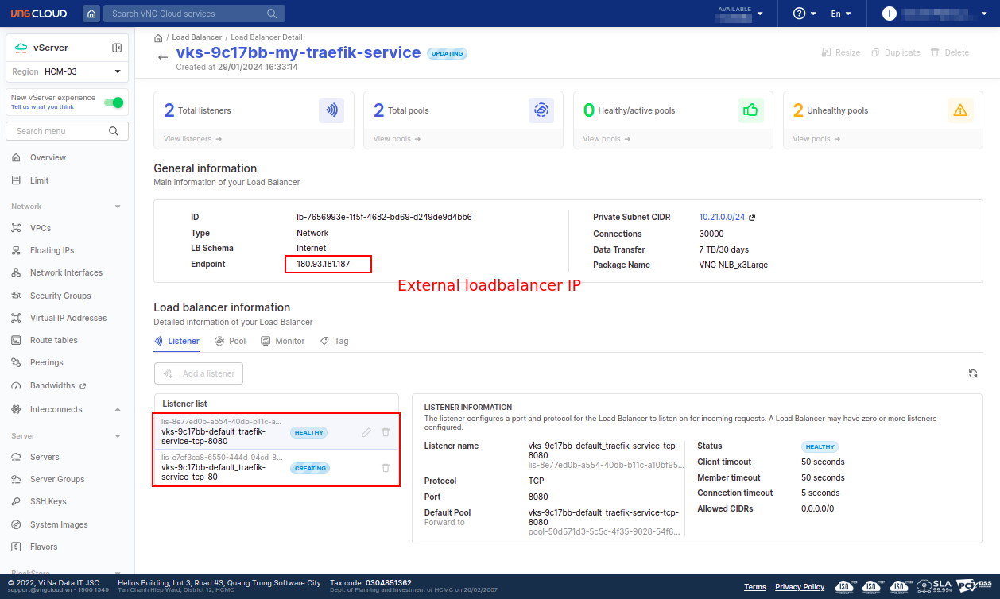
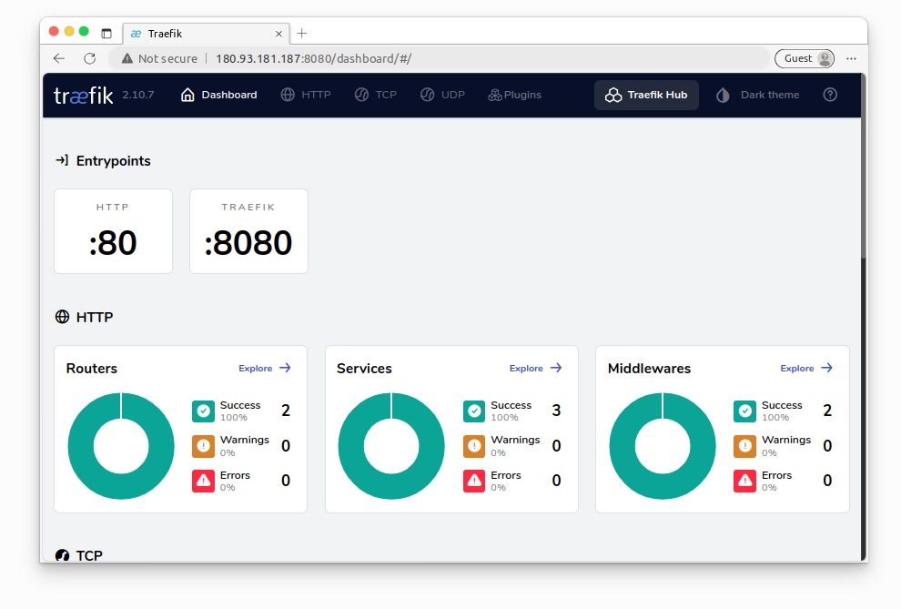

<div style="float: right;"></div><br>


# External LoadBalancer
## Example 1: Nginx service
In this hands-on lab, you'll deploy an Nginx deployment and leverage the `vngcloud-controller-manager` to seamlessly expose this service to the internet using an L4 load balancer. Apply the [nginx-internet-facing.yaml]().

```yaml
apiVersion: apps/v1
kind: Deployment
metadata:
  name: external-http-nginx-deployment
spec:
  replicas: 2
  selector:
    matchLabels:
      app: nginx
  template:
    metadata:
      labels:
        app: nginx
    spec:
      containers:
      - name: nginx
        image: nginx
        ports:
        - containerPort: 80
---
kind: Service
apiVersion: v1
metadata:
  name: external-http-nginx-service
  annotations:
    vks.vngcloud.vn/load-balancer-name: "my-nginx-service"                  # Name of the load balancer
    vks.vngcloud.vn/package-id: "lbp-ddbf9313-3f4c-471b-afd5-f6a3305159fc"  # ID of the load balancer package
spec:
  selector:
    app: nginx
  type: LoadBalancer
  ports:
  - name: http
    port: 80
    targetPort: 80
```

```bash
kubectl apply -f nginx-internet-facing.yaml
```

<center>

  
  
  \\( \small{Loadbalancer \space \space information} \\)

</center>

Check that the Nginx service has been exposed to the internet by accessing the external IP address of the load balancer.
```bash
kubectl get svc -owide
kubectl get pods -owide
```

<center>

  

</center>

Access the service via the external IP address of the load balancer.

<center>

  

</center>

## Example 2: Traefik service with multiple listeners
The [traefik-internet-facing.yaml]():
  - Creates a LoadBalancer-type Service named `traefik-service` with annotations for load balancer customization.
  - Defines ports for the Traefik dashboard and web services.
  - Specifies external traffic policy as `Local` and selects pods labeled with `app: traefik` for load balancing.

```yaml
kind: ClusterRole
apiVersion: rbac.authorization.k8s.io/v1
metadata:
  name: traefik-role

rules:
  - apiGroups:
      - ""
    resources:
      - services
      - endpoints
      - secrets
    verbs:
      - get
      - list
      - watch
  - apiGroups:
      - extensions
      - networking.k8s.io
    resources:
      - ingresses
      - ingressclasses
    verbs:
      - get
      - list
      - watch
  - apiGroups:
      - extensions
      - networking.k8s.io
    resources:
      - ingresses/status
    verbs:
      - update
---

apiVersion: v1
kind: ServiceAccount
metadata:
  name: traefik-account
---

kind: ClusterRoleBinding
apiVersion: rbac.authorization.k8s.io/v1
metadata:
  name: traefik-role-binding

roleRef:
  apiGroup: rbac.authorization.k8s.io
  kind: ClusterRole
  name: traefik-role
subjects:
  - kind: ServiceAccount
    name: traefik-account
    namespace: default
---

kind: Deployment
apiVersion: apps/v1
metadata:
  name: traefik-deployment
  labels:
    app: traefik

spec:
  replicas: 1
  selector:
    matchLabels:
      app: traefik
  template:
    metadata:
      labels:
        app: traefik
    spec:
      serviceAccountName: traefik-account
      containers:
        - name: traefik
          image: vcr.vngcloud.vn/60108-cuongdm3/traefik:v2.10
          args:
            - --api.insecure
            - --providers.kubernetesingress
          ports:
            - name: web
              containerPort: 80
            - name: dashboard
              containerPort: 8080
---

apiVersion: v1
kind: Service
metadata:
  name: traefik-service
  annotations:
    vks.vngcloud.vn/load-balancer-name: "my-traefik-service"
    vks.vngcloud.vn/package-id: "lbp-ddbf9313-3f4c-471b-afd5-f6a3305159fc"
spec:
  type: LoadBalancer
  ports:
    - port: 8080
      name: dashboard
      targetPort: dashboard
    - port: 80
      name: web
      targetPort: web
  externalTrafficPolicy: Local
  selector:
    app: traefik
```

```bash
kubectl apply -f traefik-internet-facing.yaml
```

<center>

  

  
  \\( \small{Traefik \space \space service \space \space listeners} \\)<br>

  <br>
  \\( \small{Traefik \space \space dashboard} \\)

</center>
