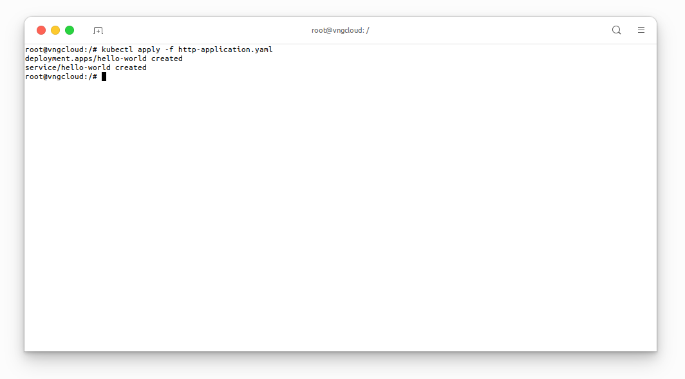
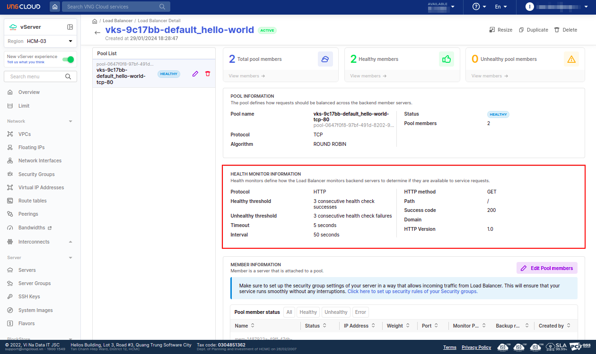
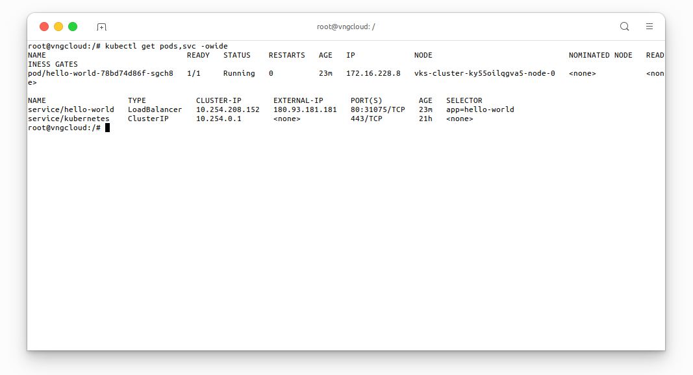
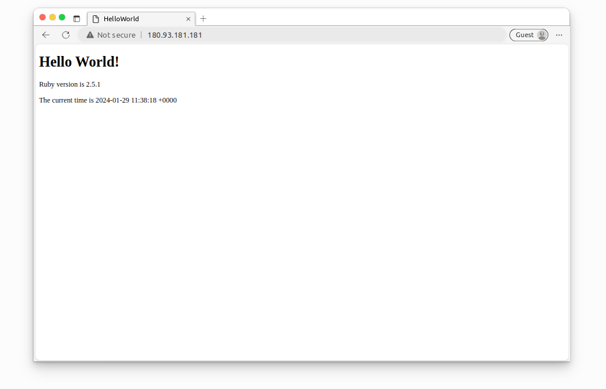

<div style="float: right;"></div><br>


# HTTP Application


This [http-application.yaml]() manifest defines a Deployment and a corresponding Service to deploy and expose a `hello-world` application within a Kubernetes cluster.

**Deployment** - `hello-world`:
  - Creates a Deployment named `hello-world`.
  - Specifies one replica for the `hello-world` application.
  - Sets the selector to match pods labeled with app`: hello-world`.
  - Defines a pod template labeled `app: hello-world` with a container named `app` running the specified Rails-based `hello-world` image on port `3000` using the **TCP protocol**.

**Service** - `hello-world`:
  - Creates a LoadBalancer-type Service named `hello-world`.
  - Includes annotations for monitoring configurations, specifying the HTTP path `/`, method `get`, and protocol `http`.
  - Specifies the service type as LoadBalancer, enabling external access.
  - Selects pods labeled with `app: hello-world` for load balancing.
  - Exposes port `80` using the **TCP protocol** and directs traffic to the `web` targetPort.

***File [http-application.yaml]()***
```yaml
apiVersion: apps/v1
kind: Deployment
metadata:
  name: hello-world
spec:
  replicas: 1
  selector:
    matchLabels:
      app: hello-world
  template:
    metadata:
      labels:
        app: hello-world
    spec:
      containers:
        - name: app
          image: vcr.vngcloud.vn/60108-cuongdm3/rails-hello-world
          ports:
            - name: web
              containerPort: 3000
              protocol: TCP
---

kind: Service
apiVersion: v1
metadata:
  name: hello-world
  annotations:
    vks.vngcloud.vn/monitor-http-path: "/"
    vks.vngcloud.vn/monitor-http-method: "get"
    vks.vngcloud.vn/monitor-protocol: "http"
spec:
  type: LoadBalancer
  selector:
    app: hello-world
  ports:
    - name: http
      protocol: TCP
      port: 80
      targetPort: web
```

```bash
kubectl apply -f http-application.yaml
```

<center>

  
  
  \\( \small{Monitor \space \space details} \\)<br>

</center>

```bash
kubectl get pods,svc -owide
```

<center>

  

</center>

Access the `hello-world` application via the public endpoint.

<center>

  

</center>