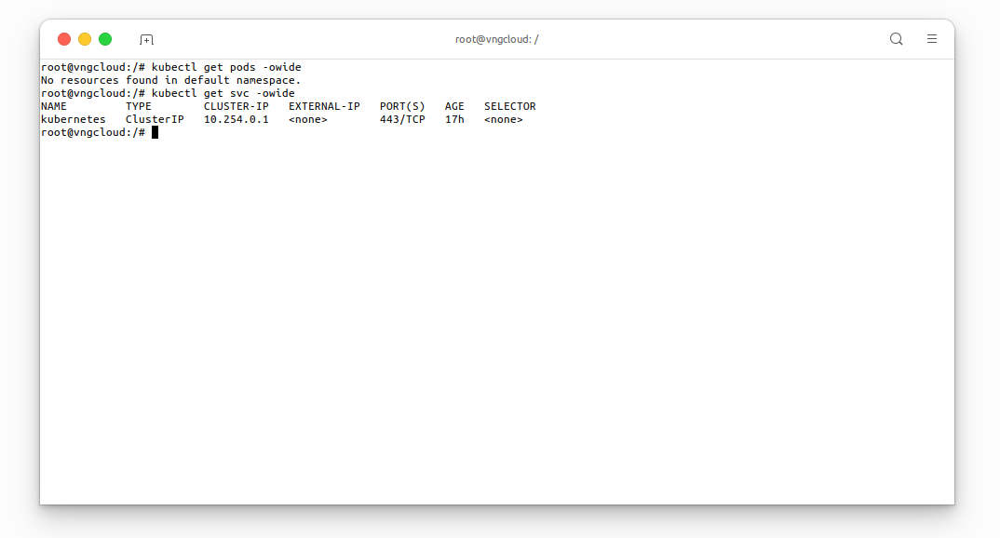

<div style="float: right;"></div><br>


# Internal LoadBalancer
Experience seamless internal load balancing for your Apache HTTP Server deployment on Kubernetes! In this deployment, we'll create a robust and scalable setup using a Deployment and an internal LoadBalancer-type Service.

Key Steps:

- **Step 1**: Apache HTTP Server Deployment:
  - Deploy the Apache HTTP Server using a Kubernetes Deployment, ensuring scalable and reliable operation.

- **Step 2**: Internal LoadBalancer Service:
  - Leverage the Service type LoadBalancer to create an internal load balancer, making your Apache HTTP Server accessible within the Kubernetes cluster.

- **Step 3**: Verification with Ubuntu Pod:
  - Validate the functionality of your internal load balancer by - creating an Ubuntu Pod within the same cluster.
  - Test connectivity to the Apache HTTP Server service, ensuring that the internal load balancer is working correctly.

**Why Internal Load Balancing?**
- Securely expose your services within your Kubernetes cluster without external access.
- Enhance isolation and privacy by utilizing internal IP addresses.
- Perfect for scenarios where your Apache HTTP Server service is intended for internal communication within your infrastructure.

## Get Started
Deploy your Apache HTTP Server with the provided manifest. This service will be accessible via the internal load balancer on port 8080.

***File [internal-loadbalancer.yaml](https://raw.githubusercontent.com/vngcloud/vcontainer-helm-infra-documentation/main/manifests/internal-lb/internal-loadbalancer.yaml)***
```yaml
apiVersion: apps/v1
kind: Deployment
metadata:
  name: internal-http-apache2-deployment
spec:
  replicas: 2
  selector:
    matchLabels:
      app: apache2
  template:
    metadata:
      labels:
        app: apache2
    spec:
      containers:
        - name: apache2
          image: httpd
          ports:
            - containerPort: 80
---

apiVersion: v1
kind: Service
metadata:
  name: internal-http-apache2-service
  annotations:
    vks.vngcloud.vn/internal-load-balancer: "true"  # MUST set like this to create an internal loadbalancer
spec:
  selector:
    app: apache2
  type: LoadBalancer                                # MUST set like this to create an internal loadbalancer
  ports:
    - name: http
      protocol: TCP
      port: 8080                                    # CAN be accessed via this port with other service in the same VPC
      targetPort: 80
```

Apply the [internal-loadbalancer.yaml](https://raw.githubusercontent.com/vngcloud/vcontainer-helm-infra-documentation/main/manifests/internal-lb/internal-loadbalancer.yaml) manifest:
```bash
kubectl apply -f internal-loadbalancer.yaml
```

<center>

  

</center>

Users can follow the progress of this load balancer is being created by access the [Load Balancer dashboard](https://hcm-3.console.vngcloud.vn/vserver/load-balancer/vlb) on the VNG CLOUD portal:

<center>

  

</center>

Wait for the load balancer to be created successfully, users can check the status of loadbalancer, listeners, pools, and its members.

<center>

  
  \\( \small{Listeners \space \space information} \\)<br>

  
  \\( \small{Pools \space \space information} \\)<br>
  
  
  \\( \small{Members \space \space information} \\)

</center>

Spin up an Ubuntu Pod to verify and test the internal load balancer using file [ubuntu-pod.yaml]().
```bash
cat <<EOF | kubectl apply -f-
apiVersion: v1
kind: Pod
metadata:
  name: ubuntu-pod
spec:
  hostNetwork: true
  containers:
  - name: ubuntu-container
    image: ubuntu:latest
    command: ["sleep", "infinity"]
EOF
```

<center>

  

</center>

Verify the necessary resources are created successfully:
```bash
kubectl get pods -owide
```

<center>

  

</center>

Make GET request to the internal IP address of the load balancer, you can get the internal IP address of the load balancer by accessing the [Load Balancer dashboard](https://hcm-3.console.vngcloud.vn/vserver/load-balancer/vlb) on the VNG CLOUD portal:

<center>

  

</center>

or by executing the following command:
```bash
kubectl get svc -owide
```

<center>

  

</center>

```bash
kubectl exec -it ubuntu-pod -- bash 

# inside the ubuntu-pod
apt update && apt install curl -y
curl http://<INTERNAL_LOADBALANCER_IP>:8080
```

<center>

  

</center>

Now, you can clean up the resources created in this lab by executing the following command:
```bash
kubectl delete pod ubuntu-pod --force
kubectl delete -f internal-loadbalancer.yaml
```

<center>

  

</center>

Verify the resources are deleted successfully:
```bash
kubectl get pods -owide
kubectl get svc -owide
```

<center>

  

</center>
