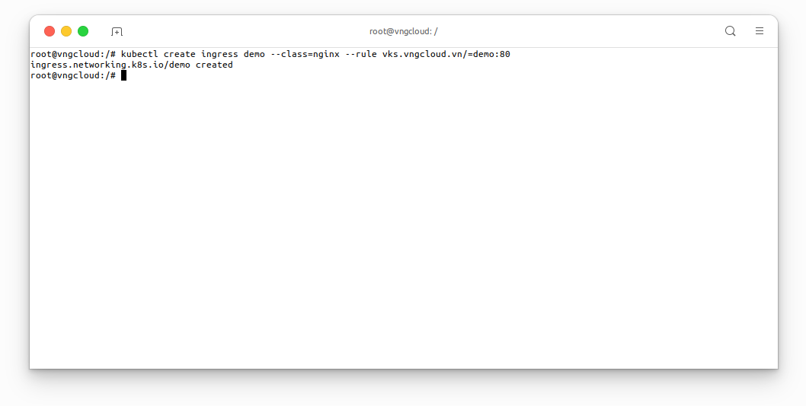
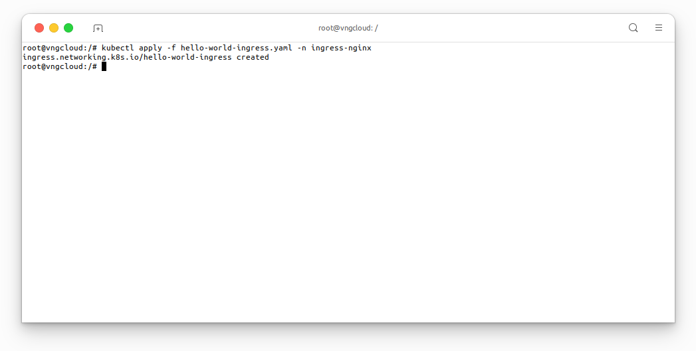

<div style="float: right;"></div><br>


# Nginx Ingress

In this section, we will deploy Nginx Ingress and then integrate it with `vngcloud-controller-manager` plugin.
Deploy the Nginx Ingress controller by applying the following [nginx-ingress.yaml]() file:
```bash
kubectl apply -f nginx-ingress.yaml
```

<center>

  

</center>

Verify Nginx ingress is running:
```bash
kubectl get pods -owide -n ingress-nginx
```

<center>

  

</center>

Check the NGINX Ingress controller has been assigned a public Ip address _(waiting about 5 mins)_:

<center>

  

</center>


Access to this IP address will show you the NGINX 404 page. This is because we have not set up any routing rules for our services yet.

<center>

  

</center>

- Set up a basic web app for testing our new Ingress controller.
```bash
kubectl create ingress demo --class=nginx --rule vks.vngcloud.vn/=demo:80
```

<center>

  

</center>

- Set up two more web apps. Now we will set up two more web apps, and route traffic between them using NGINX, file [app-1.yaml]() and [app-2.yaml]()

```bash
kubectl apply -f app-1.yaml -n ingress-nginx
kubectl apply -f app-2.yaml -n ingress-nginx
```

<center>

  

</center>

Check the new pods are running (you should see two aks-helloworld pods running):
```bash
kubectl get pods -owide -n ingress-nginx
```

<center>

  

</center>

Setup the Ingress to route traffic between the two apps, file [hello-world-ingress.yaml]():
```bash
kubectl apply -f hello-world-ingress.yaml -n ingress-nginx
```

<center>

  

</center>

Browse to the `<EXTERNAL_IP>/hello-world-one` and `<EXTERNAL_IP>/hello-world-two`:

<center>

  
  
  


</center>

From the UI:

<center>

  

</center>