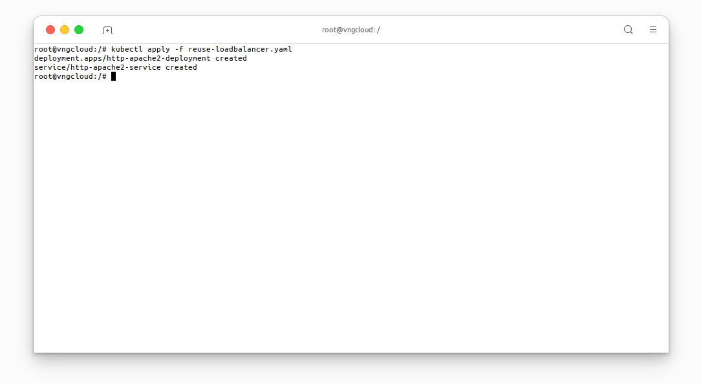
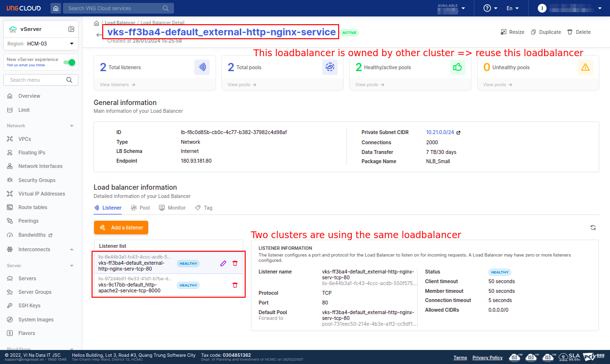
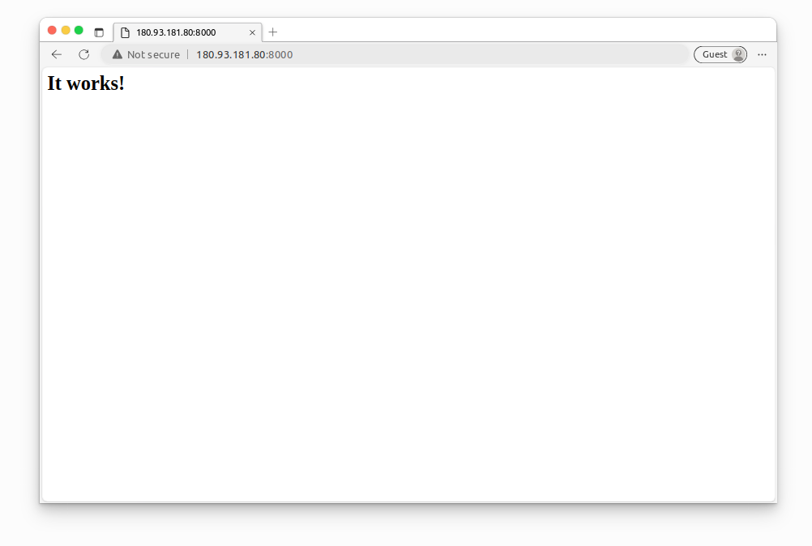

<div style="float: right;"></div><br>


# Reuse existing LoadBalancer
The [reuse-loadbalancer.yaml]() manifest orchestrates the deployment and exposure of an Apache HTTP Server using a Deployment and a corresponding LoadBalancer-type Service within a Kubernetes cluster.

**Deployment** - `http-apache2-deployment`:
  - Defines a Deployment named `http-apache2-deployment`.
  - Defines a pod template labeled `app: apache2` with a container named `apache2` running the standard HTTPd image on port `80`.

**Service** - `http-apache2-service`:
  - Creates a LoadBalancer-type Service named `http-apache2-service`.
  - Includes an annotation specifying the load balancer ID as `lb-f8c0d85b-cb0c-4c77-b382-37982c4d98af`.
  - Specifies the service type as LoadBalancer, enabling external access.
  - Exposes port `8000` using the **TCP protocol** and directs traffic to the Apache HTTP Server container's port `80`.

> ⚠️ **IMPORTANT**:
> - To reuse an existing loadbalancer, the resourceses **MUST** be in the same **SUBNET**.

***File [reuse-loadbalancer.yaml]()***
```yaml
apiVersion: apps/v1
kind: Deployment
metadata:
  name: http-apache2-deployment
spec:
  replicas: 2
  selector:
    matchLabels:
      app: apache2
  template:
    metadata:
      labels:
        app: apache2
    spec:
      containers:
        - name: apache2
          image: httpd
          ports:
            - containerPort: 80
---
apiVersion: v1
kind: Service
metadata:
  name: http-apache2-service
  annotations:
    vks.vngcloud.vn/load-balancer-id: "lb-f8c0d85b-cb0c-4c77-b382-37982c4d98af"
spec:
  selector:
    app: apache2
  type: LoadBalancer
  ports:
    - name: http
      protocol: TCP
      port: 8000
      targetPort: 80
```
```bash
kubectl apply -f reuse-loadbalancer.yaml
```

<center>

  

  

</center>

Access the above public endpoint on the browser to see the Apache HTTP Server's default page.

<center>

  

</center>