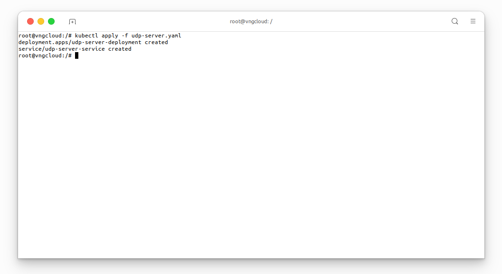
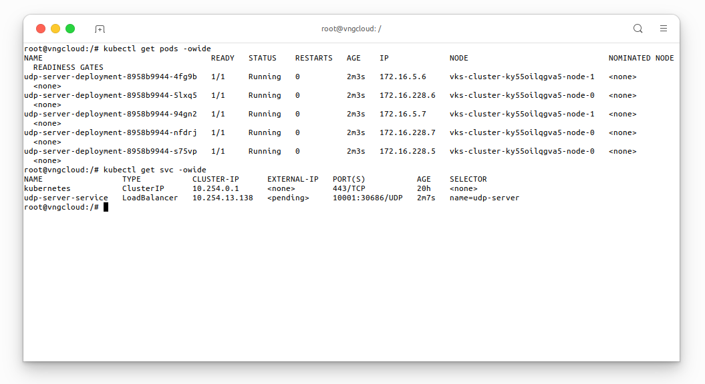
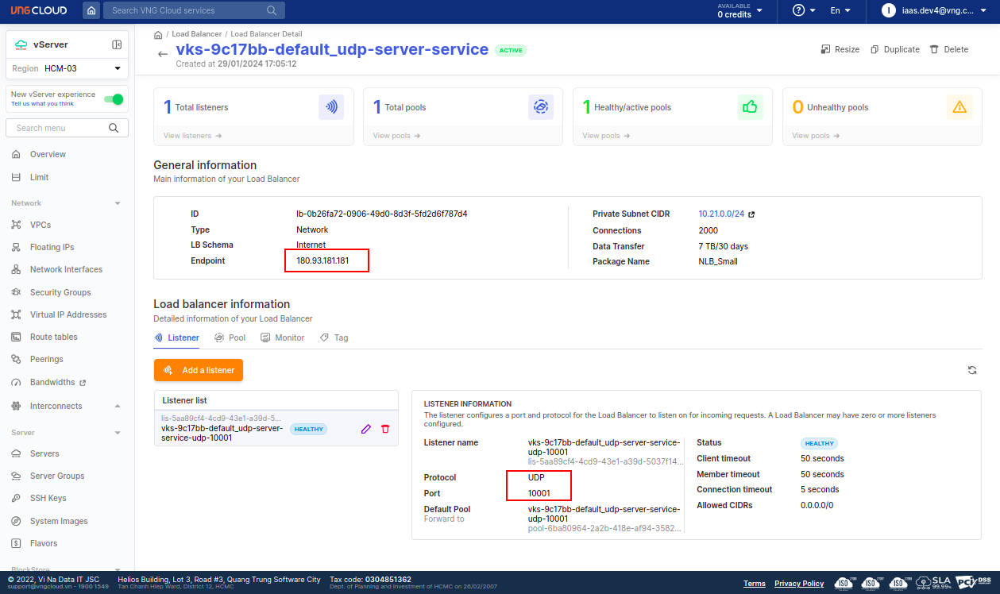
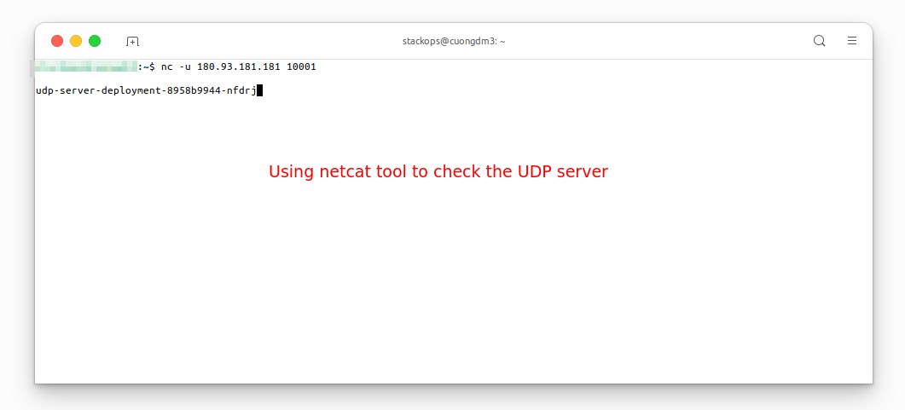

<div style="float: right;"></div><br>


# Support UDP protocol

This lab creates a Deployment and a corresponding Service to manage a UDP server application within a cluster.

**Deployment** - `udp-server-deployment`:
  - Creates a Deployment named `udp-server-deployment`.
  - Requests five replicas of the **UDP** server application.
  - Defines a pod template with the `udp-server` label and a container running the specified **UDP** server image on port `10001` with the **UDP protocol**.

**Service** - `udp-server-service`:
  - Creates a LoadBalancer-type **Service** named `udp-server-service`.
  - Includes an annotation `vks.vngcloud.vn/pool-algorithm` with the value `source-ip` for load balancer customization.
  - Specifies the service type as LoadBalancer, enabling external access.
  - Configures session affinity as `ClientIP` for persistent connections.
  - Exposes port `10001` using the **UDP protocol**.
  - Selects pods labeled with `name: udp-server` for load balancing.

***File [udp-server.yaml]()***
```yaml
apiVersion: apps/v1
kind: Deployment
metadata:
  name: udp-server-deployment
spec:
  selector:
    matchLabels:
      name: udp-server
  replicas: 5
  template:
    metadata:
      labels:
        name: udp-server
    spec:
      containers:
      - name: udp-server
        image: vcr.vngcloud.vn/60108-cuongdm3/udp-server
        imagePullPolicy: Always
        ports:
        - containerPort: 10001
          protocol: UDP
---

apiVersion: v1
kind: Service
metadata:
  name: udp-server-service
  annotations:
    vks.vngcloud.vn/pool-algorithm: "source-ip"
  labels:
    app: udp-server
spec:
  type: LoadBalancer
  sessionAffinity: ClientIP
  ports:
  - port: 10001
    protocol: UDP
  selector:
    name: udp-server
```
```bash
kubectl apply -f udp-server.yaml
```

<center>

  

</center>

Check the resources are created successfully:
```bash
kubectl get pods -owide
kubectl get svc -owide
```

<center>

  

</center>

From the portal dashboard:

<center>

  

</center>

Now, we can test the service by sending UDP packets to the external service IP address and port `10001`:

<center>

  

</center>

