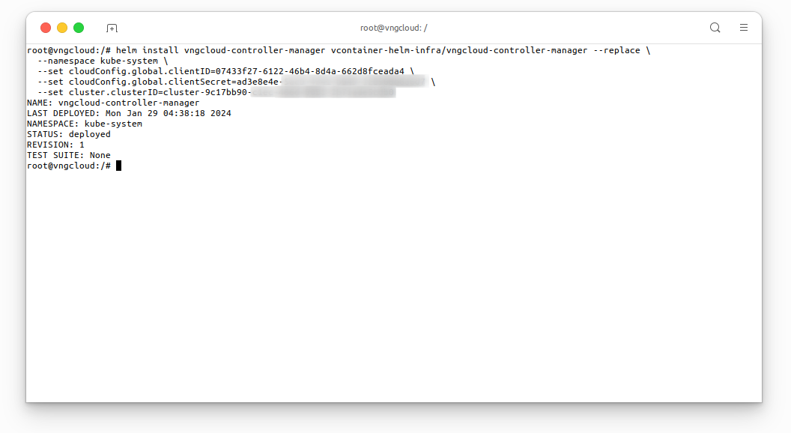

<div style="float: right;"></div><br>


# Installation
## Prepare the Service Account key pair
The `vngcloud-controller-manager` plugin necessitates a **Service Account** for executing operations on load-balancer and server resources. Users can establish a **Service Account** by accessing [the IAM dashboard](https://hcm-3.console.vngcloud.vn/iam/service-accounts). Follow the steps below to create a **Service Account**:
- **Step 1**: Access [the IAM dashboard](https://hcm-3.console.vngcloud.vn/iam/service-accounts) to create a new **Service Account**:<br>

<center>

  

</center>

- **Step 2**: Assign a name to **Service Account** and proceed by clicking **Next step**:<br>

<center>

  

</center>

- **Step 3**: Grant `vServerFullAccess` and `vLBFullAccess` permissions to **Service Account** and then click **Create Service account**:<br>

<center>

  
  

</center>

- **Step 4**: Save the **Secret key** and **Client ID** of the newly created **Service Account**:
  - Copy the **Secret key**:<br>
  <center>

    
  
  </center>
  
  - Copy the **Client ID**:<br>

  <center>

    

  </center>

## Get the cluster ID
The `vngcloud-controller-manager` plugin requires the cluster ID to be able to communicate with the `vServer` API. Users can obtain the cluster ID by accessing [the vServer dashboard](https://hcm-3.console.vngcloud.vn/vserver/container/cluster) and copying the cluster ID from the dashboard:

<center>

  

</center>

## Uninstall the old plugin
Before installing the `vngcloud-controller-manager` chart, users **MUST** uninstall the old plugin by executing the following command:

- Uninstall daemonset `cloud-controller-manager`:
  ```bash=
  kubectl get daemonset -n kube-system | grep -i "cloud-controller-manager"

  # if your output is similar to the following, you MUST delete the old plugin
  kubectl delete daemonset cloud-controller-manager -n kube-system --force
  ```

  <center>

    

  </center>

- Remove `cloud-controller-manager` service account:
  ```bash=
  kubectl get sa -n kube-system | grep -i "cloud-controller-manager"

  # if your output is similar to the above, you MUST delete this service account
  kubectl delete sa cloud-controller-manager -n kube-system --force
  ```

  <center>

    
  
  </center>

## Install the `vngcloud-controller-manager` chart
Before installing `vngcloud-controller-manager` chart, users **MUST** add `vcontainer-helm-infra` repository to their local Helm repository list, as detailed in the [Install the vcontainer-helm-infra repository](./../../index.md#install-the-vcontainer-helm-infra-repository) section, and prepare the **Service Account** key pair following the instructions in the previous section. Subsequently, execute the following command to initiate the chart installation:

```bash=
helm install vngcloud-controller-manager vcontainer-helm-infra/vngcloud-controller-manager --replace \
  --namespace kube-system \
  --set cloudConfig.global.clientID=<PUT_YOUR_CLIENT_ID> \
  --set cloudConfig.global.clientSecret=<PUT_YOUR_CLIENT_SECRET> \
  --set cluster.clusterID=<PUT_YOUR_CLUSTER_ID>
```

<center>

  

</center>

## Verify the installation
After the installation is complete, execute the following command to verify the status of the `vngcloud-controller-manager` pods:
```bash=
kubectl get pods -n kube-system | grep vngcloud-controller-manager
```

<center>

  

</center>

# Upgrade the `vngcloud-controller-manager` chart to latest version
If you followed the instructions in the [Install the vngcloud-controller-manager chart](#install-the-vngcloud-controller-manager-chart) section to install the `vngcloud-controller-manager` chart, execute the following command to upgrade the chart:
```bash=
helm upgrade vngcloud-controller-manager vcontainer-helm-infra/vngcloud-controller-manager -n kube-system
```

<center>

  

</center>