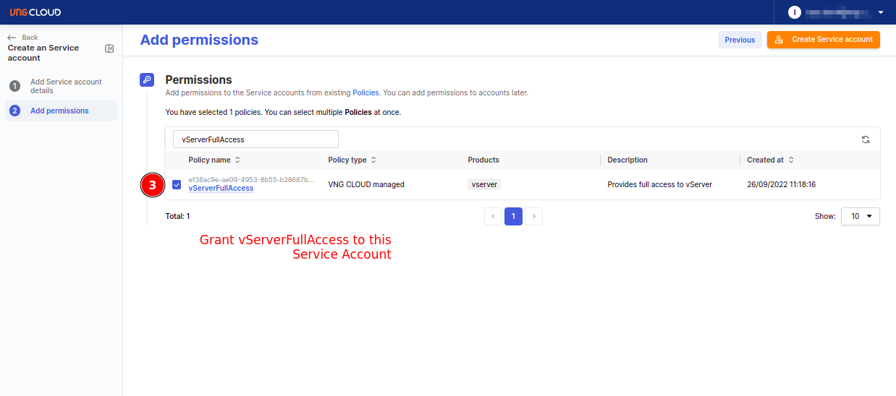

 

# Installation
## Prepare the Service Account key pair
The `vngcloud-controller-manager` plugin necessitates a **Service Account** for executing operations on load-balancer and server resources. Users can establish a **Service Account** by accessing [the IAM dashboard](https://hcm-3.console.vngcloud.vn/iam/service-accounts). Follow the steps below to create a **Service Account**:
- **Step 1**: Access [the IAM dashboard](https://hcm-3.console.vngcloud.vn/iam/service-accounts) to create a new **Service Account**: 

  

- **Step 2**: Assign a name to **Service Account** and proceed by clicking **Next step**: 

  

- **Step 3**: Grant `vServerFullAccess` and `vLBFullAccess` permissions to **Service Account** and then click **Create Service account**: 

  
  

- **Step 4**: Save the **Secret key** and **Client ID** of the newly created **Service Account**:
  - Copy the **Secret key**: 
  

    
  
  

  
  - Copy the **Client ID**: 

  

    

  
