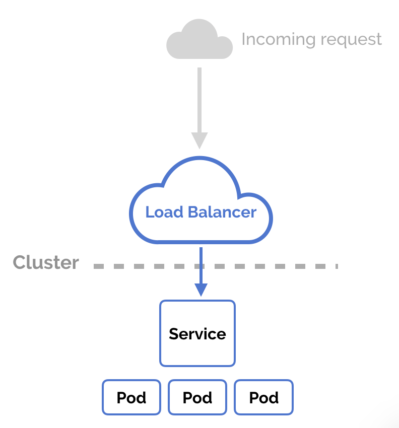
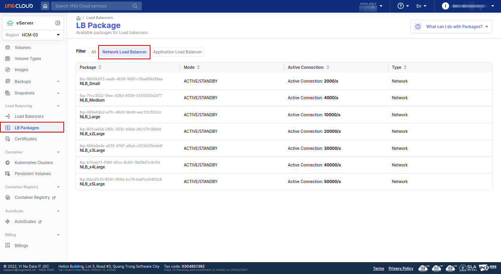

<div style="float: right;"></div><br>


# Overview

<center>

  <br>
  \\( \small{Figure \space \space 1} \\)

</center>

The `vngcloud-controller-manager` is a powerful Kubernetes plugin designed to streamline and enhance network load balancing within your clusters. This controller manager extends the capabilities of your Kubernetes environment.

**Key highlights**:
  - **Seamless Integration**: Integrate `vngcloud-controller-manager` effortlessly into your Kubernetes environment, ensuring a smooth and straightforward setup.
  - **Optimized Load Distribution**: Harness the power of advanced load balancing techniques to intelligently distribute traffic across your application instances, promoting optimal resource utilization.
  - **Flexible Configuration**: Tailor load balancing settings to match the specific requirements of your workloads, providing the flexibility needed for diverse application architectures.
  - **Scalability and Reliability**: Achieve new heights in application scalability with robust load balancing mechanisms that adapt dynamically to changing workloads.

# The plugin's annotations
The `vngcloud-controller-manager` utilizes Kubernetes annotations to define load balancer configurations. Below is a list of annotations that you can use to customize your load balancer settings in the Kubernetes `Service` manifest.

|#|Annotation|Description|Default/Example|
|-|-|-|-|
|1|`vks.vngcloud.vn/load-balancer-id`|The ID of the load balancer to be used for the service. If this annotation is not specified, a new load balancer will be created for the service.|- Default is empty.<br>- E.g: `lb-67cd0bbc-4c27-xxxx-xxxx-9f416a509577`.|
|2|`vks.vngcloud.vn/internal-load-balancer`|Specify whether the load balancer is internal or external. This field **SHOULD** be **ignored** if the `vks.vngcloud.vn/load-balancer-id` field is provided.|- Default: `false`.|
|3|`vks.vngcloud.vn/load-balancer-name`|Specify the load balancer's name for the service. If this annotation is omitted, the load balancer's name will be auto-generated in the format: `vks-<piece-of-cluster-uuid>-<service-namespace>-<service-name>`. If a specific load balancer name is provided, it will be formatted as: `vks-<piece-of-cluster-uuid>-<your-loadbalancer-name>`. This field is **disregarded** when the `vks.vngcloud.vn/load-balancer-id` field is provided.|- Default is empty.<br>- E.g: `my-new-loadbalancer`.|
|4|`vks.vngcloud.vn/package-id`|The ID of the network load-balancer package to be used for the service. If this annotation is not specified, the default package will be used. This field is **ignored** when the `vks.vngcloud.vn/load-balancer-id` field is provided. |- Default: `lbp-96b6b072-aadb-4b58-9d5f-c16ad69d36aa` _(`NLB_Small`)_.|
|5|`vks.vngcloud.vn/enable-secgroup-default`|Specify whether to attach the `Default` security group to the members of this load balancer.|- Default: `true`.|
|6|`vks.vngcloud.vn/idle-timeout-client`|Connection idle timeout is the maximum time a connection can remain open without any data transfer, after which the load balancer will close the connection. Range:  \\( 1 \Rightarrow 3600 \\).|- Default: `50`.|
|7|`vks.vngcloud.vn/idle-timeout-member`|Backend member inactivity timeout in seconds. Range:  \\( 1 \Rightarrow 3600 \\).|- Default: `50`.|
|8|`vks.vngcloud.vn/idle-timeout-connection`|Backend member connection timeout in seconds.|- Default: `5`.|
|9|`vks.vngcloud.vn/listener-allowed-cidrs`|Access control list (ACL) to limit incoming traffic to a listener to a set of allowed source IP addresses (CIDRs).|- Default: `0.0.0.0/0`.<br>- E.g: ` 172.16.0.0/24`|
|10|`vks.vngcloud.vn/pool-algorithm`|The load balancing algorithm used to determine which backend server to send a request to. Possible values: `round-robin`, `least-connections`, and `source-ip`.|- Default: `round-robin`.|
|11|`vks.vngcloud.vn/monitor-healthy-threshold`|The number of successful health checks a pool member must pass before it is considered as a healthy pool.|- Default: `3`.|
|12|`vks.vngcloud.vn/monitor-unhealthy-threshold`|The number of consecutive failed health checks before it is considered as unhealthy pool.| - Default: `3`.|
|13|`vks.vngcloud.vn/monitor-timeout`|The maximum time will wait for a response from a pool member before considering it a failed health check.|- Default: `5`.|
|14|`vks.vngcloud.vn/monitor-interval`|The period of time between successive health checks performed by an individual pool in seconds.|- Default: `30`.|
|15|`vks.vngcloud.vn/monitor-protocol`|The type of health monitor. Possible values: `tcp`, `ping-udp`, `http`, and `https`.|- Default: `tcp`.|
|16|`vks.vngcloud.vn/monitor-http-method`|Define the HTTP method used for sending health check requests to the backend servers. This option is applicable only when the `vks.vngcloud.vn/monitor-protocol` is set to `http` or `https`. Acceptable values include `get`, `post`, and `put`.| - Default: `get`.|
|17|`vks.vngcloud.vn/monitor-http-path`|Use the default path of `/` to ping the root, or specify a custom path if preferred. This option is applicable only when the `vks.vngcloud.vn/monitor-protocol` is set to `http` or `https`.| - Default: `/`.|
|18|`vks.vngcloud.vn/monitor-http-success-code`|Define the HTTP status code that indicates a successful health check. This option is applicable only when the `vks.vngcloud.vn/monitor-protocol` is set to `http` or `https`.|- Default: `200`.|
|19|`vks.vngcloud.vn/monitor-http-version`|Define the HTTP version used for sending health check requests to the backend servers. This option is applicable only when the `vks.vngcloud.vn/monitor-protocol` is set to `http` or `https`. Acceptable values include `1.0`, and `1.1`.|- Default: `1.0`.|
|20|`vks.vngcloud.vn/monitor-http-domain-name`|The domain name, which be injected into the HTTP Host Header to the backend server for HTTP health check. This option is applicable only when the `vks.vngcloud.vn/monitor-protocol` is set to `http` or `https` and the `vks.vngcloud.vn/monitor-http-version` field is `1.1`.|- Default: `nip.io`.|


The aforementioned fields **CAN** be configured using the default `values.yaml` file in **Helm**, eliminating the need for manual configuration in each Kubernetes service manifest's annotations.

***File [values.yaml](https://artifacthub.io/packages/helm/vcontainer-helm-infra/vngcloud-controller-manager?modal=values)***
```yaml=
# ... other configurations

# These will be used to create loadbalancer, listener, pool, monitor and member resources
cloudConfig:
  global:
    identityURL: "https://iamapis.vngcloud.vn/accounts-api"
    vserverURL: "https://hcm-3.api.vngcloud.vn/vserver"
    clientID: "<PUT_YOUR_CLIENT_ID>"
    clientSecret: "<PUT_YOUR_CLIENT_SECRET>"

  vlb:
    defaultL4PackageID: "lbp-96b6b072-aadb-4b58-9d5f-c16ad69d36aa"   # vks.vngcloud.vn/package-id
    defaultListenerAllowedCIRDs: "0.0.0.0/0"                         # vks.vngcloud.vn/listener-allowed-cidrs
    defaultIdleTimeoutClient: 50                                     # vks.vngcloud.vn/idle-timeout-client
    defaultIdleTimeoutMember: 50                                     # vks.vngcloud.vn/idle-timeout-member
    defaultIdleTimeoutConnection: 5                                  # vks.vngcloud.vn/idle-timeout-connection
    defaultPoolAlgorithm: "round-robin"                              # vks.vngcloud.vn/pool-algorithm
    defaultMonitorHealthyThreshold: 3                                # vks.vngcloud.vn/monitor-healthy-threshold
    defaultMonitorUnhealthyThreshold: 3                              # vks.vngcloud.vn/monitor-unhealthy-threshold
    defaultMonitorTimeout: 5                                         # vks.vngcloud.vn/monitor-timeout
    defaultMonitorInterval: 50                                       # vks.vngcloud.vn/monitor-interval
    defaultMonitorHttpMethod: "get"                                  # vks.vngcloud.vn/monitor-http-method
    defaultMonitorHttpPath: "/"                                      # vks.vngcloud.vn/monitor-http-path
    defaultMonitorHttpSuccessCode: "200"                             # vks.vngcloud.vn/monitor-http-success-code
    defaultMonitorHttpVersion: "1.0"                                 # vks.vngcloud.vn/monitor-http-version
    defaultMonitorHttpDomainName: ""                                 # vks.vngcloud.vn/monitor-http-domain-name
    defaultMonitorProtocol: "tcp"                                    # vks.vngcloud.vn/monitor-protocol

# ... other configurations
```

## LoadBalancer Packages
The `vngcloud-controller-manager` supports multiple load balancer packages, each with its own set of specifications. Users can access the [LoadBalancer packages dashboard](https://hcm-3.console.vngcloud.vn/vserver/load-balancer/package) to view the available packages and their corresponding specifications. The following table lists the available packages and their corresponding specifications.

<center>

  
  \\( \small{Figure \space \space 2} \\)

</center>